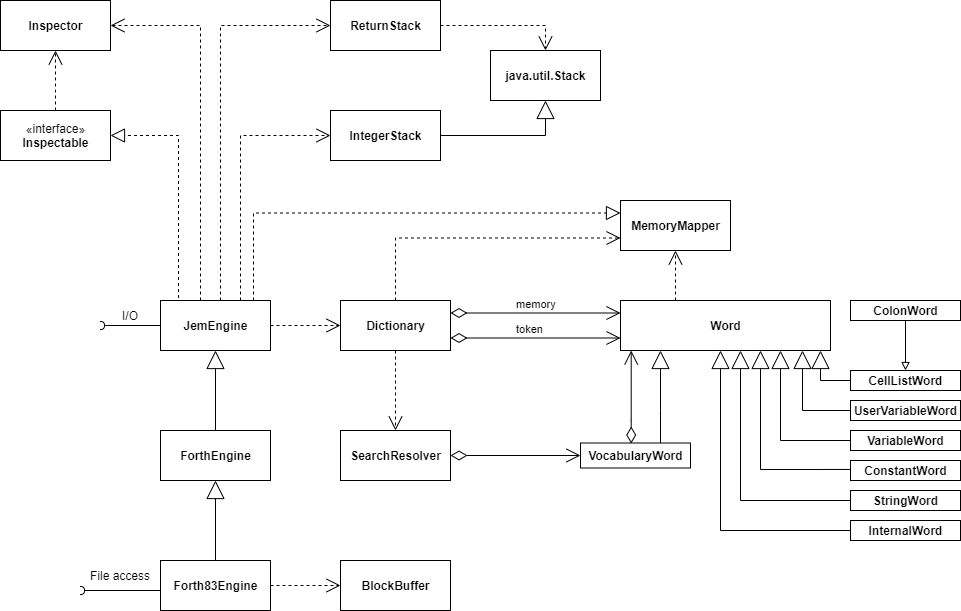

# The Forth Class Model #

The class diagram shows all classes involved in the forth engine system.
It does not cover the classes connecting the entige to the "real world"
such as the text console an the graphical IDE.

## Overview ##

The system consists of x components 
- The core engine with
    - The memory stack
    - The return Stack
- The Dictionery with
    - The Memory Mapper

## The Engine Core ##
The engine does the computing itself. It interprets existing words and
compiles new words. It holds the two stacks needed for preocessing and
has interfaces for I/O and file access.

The <tt>inspectable</tt> interface is used to plug the enine into the IDE
to display the internal state and provides a hook for debugging features.

The core implementation is currently devided into thee classes inheriting from each other.
The idea is to have layers for the implementation of different engines. The only one that is
in some way complete is the <tt>Forth83Engine</tt> class that implements most of the Forth 83 standard.
figForth 79, Forth 2012 might be other implementations.

### JemEngine ###
The Base class contains only a minimum set of fofth words needed.
Anything else might be implemented as java or forth code in the other classes.
It keeps the Stacks and provides all basic operations on them to keep the
implementation hidden from the sub classes. The I/O is merely a set of hooks that
are wrapped by forth words. The sub classes or the embedding system may provide
implementations.

### ForthEngine ###
Contains a set of java implementations for forth words that are common to most of the
forth variants. It is not good practice to use inheritance only to share methods and static
elemnts -- especially _static_ elements like fields. But actually it was the easiest way to
get all the words together and -- it works :-)

### Forth83Engine ###
This is, as mentioned above, a nearly complete implementation of the Forth 83 stdandard.
Including the 1k-block oriented access to the file system emulated by the class <tt>BlockBuffer</tt>.

It comes with a monochrome text console for a nice retro experience :-) 
I also used it as an example to experiment with reactive pipes and the more classical I/O.

## The Stacks ##
Forth uses two stacks: the data stack (or just "the stack") and the return stack.
Since forth originally didn't support floating point arithmetics some newer implementatons
maintain a third stack for floating point numbers. jemForth unly uses the two standard stacks.

The data stack is a subclass of the JDK class <tt>Stack</tt> while the return stack is a wrapper.
This was an ad hoc decision und wuld not be necessary. Since data is exchanged between the two stacks,
they should be in some way compatible.

### The Data Stack ###
Since forth words have no paramters like functions or methods the data has to be passed in another way.
Data is passed through the data stack. To pass an argument the data is pushed, to use an argument tha data
is popped. jemForth is <tt>Integer</tt> oriented. All elements on the data stack are Integer objects.
It would be possible to use <tt>Long</tt> for the use of greater numbers.

### The Return Stack ###
The return stack is used to store addresses instead of data. It is used during interpretation to
implement jumps when returning from a funktion call (in forth: word execution) or when executing
conditional commands (if..else constructs) or loops.

The return stack can also be used as a temporary memory during word execution. Improper
use of the return stack might lead to unexpected resuls when data is interpreted as addresses.

## The Dictionary ##
The Dictionary is the structure that contains all word definitions of a forth
engine. The words in a dictionary may be grouped into multiple vocabularies.

The vocabularies are not manages by a separate vocabulary class.
Instead we use the forth approach and keep the words of a vocabulary as
a list in a special <tt>VocabularyWord</tt> instance.

The original forth approach to retrieve words throuch a linked list was replaced
by an ordinary java <tt>List</tt> that is searched sequentially. The access speed
should be similar but it should always be possible to replace the dictionary
by a completely different implementation.

A real forth system can access words by their physical memory access. Since the
memory access in jemforth is not implemented as a big linear array, the access
is speeded up by using an access token (xt) that identifies the word. The dictionary
keepd a hash table that maps access token to word instances. This is not a hack,
"real" threaded languages use the xt concept when the memory cannot be accessed
directly or is not organized sequentially.

The <tt>Dictionary</tt> class handles the memory access through the methods
<tt>fetch</tt>, <tt>cFetch</tt>, <tt>store</tt> and <tt>cStore</tt>. The actual
access to the data stored in the words is delegated to the individul words.
The address calculation is delegated to the class <tt>MemoryMapper</tt>.

### The SearchResolver ###
The implementation is a bit messy here. The Forth83 standard uses a different approach
to organize vocabularies in the decitionary. There's the _current_ dictionary that is
used to retrieve words and the compile dictionary to which new words are compiled.

The implementation got mixed up with the 2012 approach that uses _search orders_ to
organize the vocabularies. Zhe implementatio is a hybrid that tries to combine both
concepts -- this is not ideal...

### The MemoryMapper ###
In a real forth system (real) memory is organized as a large random access
array with consecutive numbered cells. The JVM does not allow access to the
physical memory making all memory access virtual. As a consequence jemForth
emulates the linear address space making real memory access even more virtual
than the virtual memory access of the JVM...

The memory mapper is used to map logical memory specifiers -- the locators -- to
point into a virtual linear memory space. The locators are integer numbers, not classes.
This way address mapping can be done with bit operations and basic arithmetic operations
for a better performance.

It might be interesting to implement a strictly linear address space but it might be
challenging to combine this with the java oriented word implemetations. The memoy mapping
on the other hand enables pretty unforthy features as growing and shrinking string words.

The memory mapper is basically a collection of static methods for address mapping.
The only non static feature is a memory pointer that points to the next locator available 
for word definition. There might be a problem when memory is freed with the FORGET word...

### Words ###
Always come easy -- when you are high on forth...

Every word in a real forth system has the same structure. I wanted to use the power of java,
especially the power of lambda expressions in the implememtation. Since it is not possible
to use a memory address in java to directly trigger the processor interpretation, lambda expressions
are used to represent native machine language. This is pretty close and pretty cool either.

To make the implementation even easier I decided to use different implementations for different
words. It is possible to implement a minimalistic forth engine that uses only forth mechanisms
to implement the different words -- that's the real hidden force behind forth -- but I have to
admid I was to lazy... I leave is as an exercise to the reder :-)
