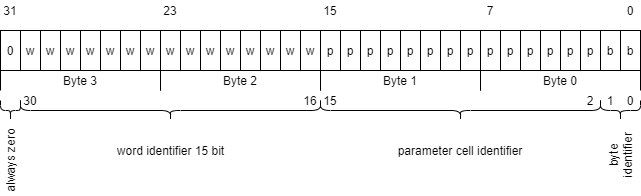

# Memory Model #

Memory mamagement is one of the main differences between real forth and jemForth.
In the early forth systems physical memory was organized as one (more or less= large random access
array with consecutive numbered bytes. This was at least true until paged memory management appeared.

Since the idea of jemForth came from figForth 79 and the Forth 83 standard, it tries to emulate
some sort of linear memory space. Nevertheless the JVM does not allow access to the physical memory
making all memory access virtual. As a consequence jemForth's  emulation of the linear address space
makes real memory access even more virtual than the virtual memory access of the JVM...

To achieve this the engine uses 32 bit integer values as address identifiers. The 
<tt>[MemoryMapper](../main/java/io/github/mletkin/jemforth/engine/MemoryMapper.java)</tt> class
calculates from these logical addresses values that are used to locate the data for retrieval
and manipulation. Thus these address identifiers are called "locators". 

The diagram shows the structure of a locator. It's simple so the calculation can be done with
simple bit masking and shifting.

- **the highest bit** 
Since Java has no unsigned integer type the most significant bit is set to zero.
Because java uses two's complement to represent negative integers it can not handle the sign bit
like an additional bit. To avoid conversation or the use of long integers, we use positive 31bit
integers and reduce the available address space to about 1GB.  
This is more than 32.000 times a 8bit system offers -- and should be sufficient.

- **the word identifier** 
Bit 16 to 30 identify the word. The word identifier is also called the access token or "xt".
The xt is used by the interpreter to find the word in the dictionary

- **the pfa cell identifier** 
Bit 2 to 15 identify the cell in the paramter area in the word if the word is cell aligned.
A cell is 4 bytes long and can take an address (or locator). Is is used by the
<tt>[ColonWord](../main/java/io/github/mletkin/jemforth/engine/ColonWord.java)</tt>
where the words can represent words to be executed. The cell identifier begins at bit 2
because a cell is 4 bytes long.

- **the byte identifier** 
Bit 0 and  identify the byte within a cell. In byte aligned words -- such as 
<tt>[StringWord](..//main/java/io/github/mletkin/jemforth/engine/StringWord.java)</tt>
-- each byte can be accessed using the byte identifier with the methods <tt>cFetch</tt> and <tt>cStore</tt>.

The <tt>[MemoryMapper](../main/java/io/github/mletkin/jemforth/engine/MemoryMapper.java)</tt> class
provides methods to extract the parts from an address identifier and to compose them from the components.

Currently all these methods are implemented as static methods. This is quite unfortunate because it makes
it impossible to replace the memory system. This might be cahnged. Interesting memory models could be
a model with 64bit cells or a model with a _really_ linear structure.
  
# Why is it designed like this? #
- Addressing is linear 
Like the physical memory, the locators form a single linear space with growing addresses.
All bytes of a word are in a single space of consecutive addresses. 
The caveat is that there mighth be "holes" in the address spaces and therefore illegal
addresses exist.

- Extensible words 
Other than the "real" forth words, jemForth words may be extended after creation.
Associative arrays can easily be impelemented and strings do not have a maximum length
that has to be defined at creation time.

- location as easy as possible 
Each cell or byte of a word can be accessed without overhead since transformation of addresses and
locators is reduced to simple bit operations.  

- uniformity 
The access to the mass storage via the
<tt>[BlockBuffer.java](../main/java/io/github/mletkin/jemforth/engine/f83/BlockBuffer.java)</tt> class
in the Forth 83 engine uses a special locator with the zero word identifier. Memory mappes I/O
can be implemented -- or emulated -- In the same way.

The access to the word header that contains name with length byte, cfa, lfa, immediate and hidden flag
is impossible. This might be changed but was not necessary for the current implementation.
