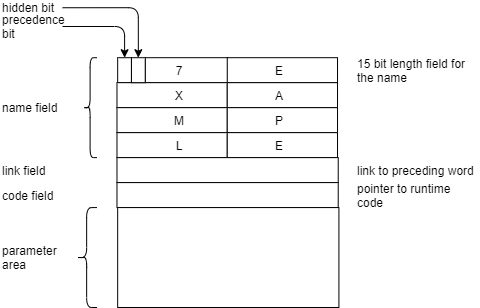

# A Word on Words #

The diagram shows a typical memory layout of a forth word entry in the dictionary.
Instead of emulating the physical memory structure I used a mor javistic approach.

The implementation in
[Word.java](../../src/main/java/io/github/mletkin/jemforth/engine/Word.java)
shows the basich structure of a jemForth word. 

- The presedence bit indicates whether the word will be compiled or interpreted,
it maps to the field <tt>immediate</tt>
- The hidden bit controls the visibility on retrieval, it maps to the field <tt>hidden</tt>
- The name field contains the name of the word. It maps to the field <tt>name</tt>. 
While the name length is usually limited to 14 bit, it might be as long as any other
string in Java -- about 2G, theoretically.
- The link creates a linked list containing all forth words. It's used for word retrieval. 
In jemForth it has no counterpart, words are retrieved via the class 
[Dictionary.java](../../src/main/java/io/github/mletkin/jemforth/engine/Dictionary.java)
- The code field points to the runtime code that's executed when the word is interpreted. 
Since this is normally interpreted as machine code, jemForth implements it as a labda expression.
It maps to the field <tt>cfa</tt>.
- The parameter area is an array of memory cells. Java Words implement them differently.

Although it is possible to implement every word in the manner, jemForth implements different
types of words in different subclasses. This is less tedious and allows to make use of all
available java features. 

## ConstantWord ##
The simlest kind of word is the constant. It's int value is set on instantiation and the
cfa code simply put's the value on the stack.

## VariableWord ##
Acts pretty like a constant word but it's value can be changed. 
The cfa code pushes the start of the parameter area on the stack.

## UserVariableWord ##
Behaves like a standard forth variable word as described. But instead of storing the
value in the object itself, it uses two injectable lambda expressions. That makes it 
possible to attach the word to "something" outside the forth engine, for example a display
object in a GUI.

## String Word ##
While normal strings have a fixed maximum length and use ASCII encoding,
the jemForth strings are resizable and use UTF-16 internally. 
Length field and the single characters can be accessed in the forth way. 
The cfa code pushes the address of the length byte (int) on the stack.

